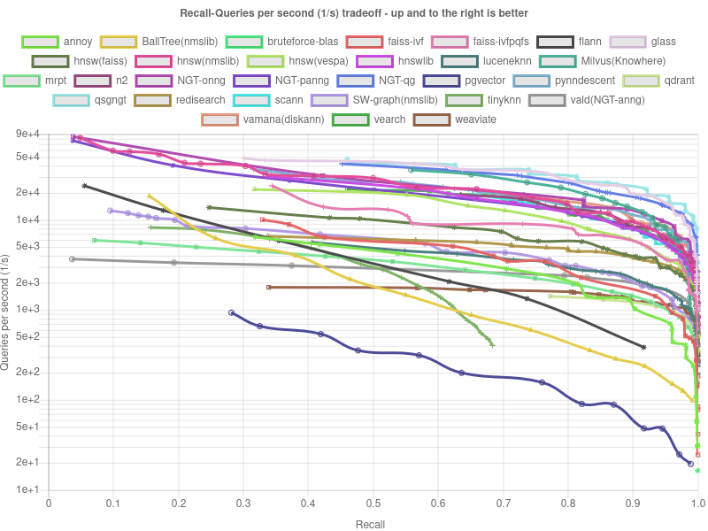
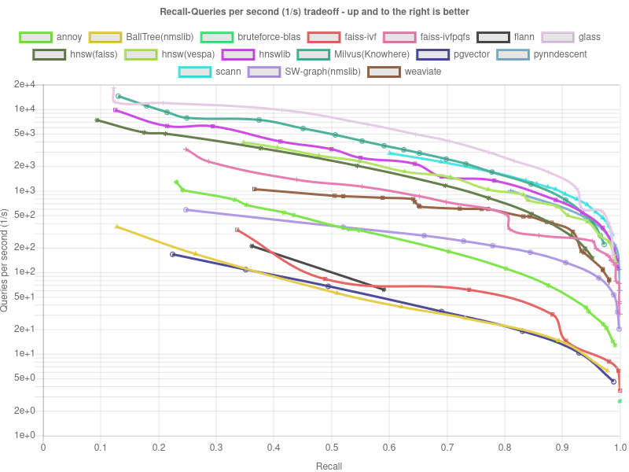

# Технический отчет: Процесс разработки и выбор алгоритмов для ANNS

## Введение

Наша команда разработала решение для задачи приближенного поиска ближайших соседей (Approximate Nearest Neighbor Search, ANNS) на основе анализа существующих методов и выбора оптимального инструмента для повышения эффективности поиска и точности результата. Мы выбрали Python в качестве языка программирования, так как он обеспечивает высокую скорость разработки, имеет широкую поддержку библиотек для научных вычислений и позволяет использовать уже оптимизированные на C/C++ алгоритмы, что минимизирует потери производительности.

## Этап 1: Начальный подход и улучшение базовой реализации

В качестве начальной точки мы использовали базовое решение, предоставленное организаторами. Для повышения производительности мы выбрали библиотеку FAISS (https://arxiv.org/abs/2401.08281 Facebook AI Similarity Search) по следующим причинам:

- **Оптимизация для работы с большими объемами данных**: FAISS разработана с акцентом на эффективный поиск ближайших соседей в масштабных наборах данных.
- **Множество оптимизаций**: Библиотека использует SIMD-инструкции для повышения производительности, улучшенное обращение с памятью, быстрая обработка векторных операций.
- **Широкий выбор алгоритмов**: FAISS предлагает разнообразные алгоритмы для поиска, позволяя выбрать наиболее подходящий метод в зависимости от конкретных задач.
- **Наличие докуметации**: FAISS предоставляет простую и интуитивно понятную документацию, что облегчает процесс освоения для новых пользователей.

### Шаги

1. **IndexFlatL2**: Начальная имплементация с использованием IndexFlatL2 дала значительный прирост в метрике SIFT1M QPS — с 0.03 до 3.12. Однако для датасета GIST оставалась ошибка ограничения по времени (time limit).
2. **IndexIVF Flat**: Дальнейшая оптимизация включала переход на обучаемый индекс IndexIVF Flat, который позволил преодолеть ограничение по времени на GIST. К сожалению, при параллельной обработке запросов возникла нехватка памяти.
3. **Product Quantization (PQ)**: Для сокращения использования памяти был применён метод квантизации продукта. Однако метрика Recall снизилась с ~0.99 до ~0.3, что побудило нас к более глубокому изучению алгоритмов ANNS.

## Этап 2: Анализ алгоритмов и выбор подхода ANNS

Для выбора лучшего алгоритма мы обратились к ресурсу ANN Benchmarks, где представлены результаты тестирования различных алгоритмов на SIFT1M и GIST. Мы заметили, что HNSW показал неплохие результаты, поэтому было решено использовать его как следующий этап решения.

|   **SIFT** | **GIST**  |
|------------------------------|------------------------------|
|         |         |

## Этап 3: Применение HNSW и поиск парето оптимума гиперпараметров

Применение HNSW показало неплохие результаты: по сравнению с предыдущими значениями Recall на GIST, которые были около ~0.1, мы поднялись до ~0.8, а на SIFT — с ~0.1 до ~0.93. Однако оставалась проблема с запросами в секунду, которые находились на уровне ~0.09 для GIST.

Следующим этапом стало применение **скалярной квантизации** для сжатия векторов. Мы использовали 8-битную квантизацию, что позволило сократить размер векторов в 4 раза и значительно ускорить получение запросов: QPS поднялся до ~3 на GIST. Однако метрика Recall упала до ~0.5 также для GIST.

После получения данных результатов было решено найти **парето оптимум гиперпараметров** для построения индекса и последующего поиска. Мы рассмотрели такие параметры, как:
- **M**: количество соседей, которое влияет на структуру графа и скорость поиска. Чем больше M, тем точнее результаты, но и больше затраты на память.
- **efConstruction**: параметр, определяющий количество соседей, которые нужно учитывать при построении индекса. Он влияет на качество индекса и время его построения.
- **efSearch**: параметр, который управляет количеством соседей, которые будут использованы при поиске. Увеличение этого значения может улучшить точность, но также требует больше времени на обработку запросов.

В итоге мы остановились на следующих значениях: **M = 16, efConstruction = 80, efSearch = 2048**.

## Заключение

В ходе работы над задачей приближенного поиска ближайших соседей (ANNS) мы последовательно исследовали и улучшали различные алгоритмы, применяемые в библиотеке FAISS. Начальная реализация показала значительные улучшения по сравнению с базовыми метриками, но возникшие ограничения по времени и памяти потребовали дальнейшей оптимизации.

На этапе выбора алгоритма мы обратились к ресурсу ANN Benchmarks, где HNSW продемонстрировал хорошие результаты. Применение этого алгоритма позволило значительно повысить метрики Recall, но также выявило проблемы с производительностью, что побудило нас использовать скалярную квантизацию для повышения скорости обработки запросов.

Наконец, мы провели оптимизацию гиперпараметров, что позволило добиться баланса между производительностью и точностью. Подобранные значения параметров M = 16, efConstruction = 80, efSearch = 2048 обеспечили удовлетворительные результаты для обоих наборов данных, делая наше решение более эффективным.

**Конечный результат**

| Метрика          | SIFT     | GIST      |
|------------------|----------|-----------|
| build (seconds)  | 250.0    | 1708.0    |
| Seq Recall       | 0.986469 | 0.963089  |
| Seq QPS          | 4.73     | 2.33      |
| 2 Threads Recall | 0.987291 |  0.964197 |
| 2 Threads QPS    | 7.14     | 3.22      |
| 4 Threads Recall | 0.987243 | 0.954615  |
| 4 Threads QPS    | 8.19     | 2.56      |

## Источники
1. The Faiss library (https://arxiv.org/abs/2401.08281)
2. ANN-benchmarks (https://ann-benchmarks.com/)

